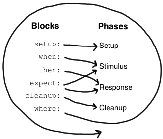

# Spock

是一個建構於 Groovy 語言的測試框架，可透過 Junit runner 執行測試。

主要的類別是 `spock.lang.Specification`，常用的 `geb.spock.GebReportingSpec` 和 `geb.spock.GebSpec` 都是繼承 Specification 類別，我們實作 Specification 來定義將測試的規格跟測試步驟。

## Specification
主要的類別是 `spock.lang.Specification`，常用的 `geb.spock.GebReportingSpec` 和 `geb.spock.GebSpec` 都是繼承 Specification 類別，我們實作 Specification 來定義將測試的規格跟測試步驟。

```groovy
class MyFirstSpecification extends Specification {
  // fields
  // fixture methods
  // feature methods
  // helper methods
}
```
## 屬性 (Fields)
```groovy
def obj = new ClassUnderSpecification()
def coll = new Collaborator()
```
or
```groovy
@Shared res = new VeryExpensiveResource()
```
or
```groovy
static final PI = 3.141592654
```
## 固定方法 (Fixture Methods)
* setup：在每個功能方法之前執行
* cleanup：在每個功能方法之後執行
* setupSpec：在第一個功能方法之前執行
* cleanupSpec：在最後一個功能方法之後執行


## 功能方法 (Feature Methods)
自行定義的方法

```groovy
def "login"() {
  // 實作內容...
}
```


## 區塊 (Blocks)


### Setup
* 用來準備測試所需要的資料，所使用的區塊，例如載入特定使用者資料，做為測試使用。
* 必須在第一個

### When 和 Then
* 必須成對使用
* When：進行測試行為，例如輸入帳號、密碼，點擊登入按鈕
* Then：確認執行結果，需為判斷式

### Expect
* 檢查是否結果如預期
* 適用於簡單的判斷

```groovy
expect:
Math.max(1, 2) == 2
```
等同於
```groovy
when:
def x = Math.max(1, 2)

then:
x == 2
```
### Cleanup
* 清除廢棄測試資料
* 釋放資源

```groovy
setup:
def file = new File("/some/path")
file.createNewFile()

// ...

cleanup:
file.delete()
```
### Where
* 用於提供不同變數內容
* 必須是最後一個區塊
* 可使用文字表格作為測試資料

```groovy
def "兩個數值比大小運算"() {
  expect:
  Math.max(a, b) == c

  where:
  a | b || c
  5 | 3 || 5
  1 | 9 || 9
  5 | 9 || 9
}
```

## 幫助方法 (Helper Methods)

```groovy
def "offered PC matches preferred configuration"() {
  when:
  def pc = shop.buyPc()

  then:
  matchesPreferredConfiguration(pc)
}
```

**範例一**
```
def matchesPreferredConfiguration(pc) {
  pc.vendor == "Sunny"
  && pc.clockRate >= 2333
  && pc.ram >= 4096
  && pc.os == "Linux"
}
```
**錯誤訊息**
似乎透露的訊息不多，可以改用範例二的做法。

```
Condition not satisfied:

matchesPreferredConfiguration(pc)
|                             |
false                         ...
```
**範例二**
```
void matchesPreferredConfiguration(pc) {
  assert pc.vendor == "Sunny"
  assert pc.clockRate >= 2333
  assert pc.ram >= 4096
  assert pc.os == "Linux"
}
```
**錯誤訊息**
```
Condition not satisfied:

assert pc.clockRate >= 2333
       |  |         |
       |  1666      false
       ...
```
## 規格文件
可以直接使用 domain 語言，替區域撰寫描述

```
setup: "開啟與資料庫的連線"

and: "載入客戶資料"

and: "載入產品資料"

```

## 與 Junit 的對照表
| Spock | JUnit |
| -- | -- |
| Specification | Test class |
| setup() | @Before |
| cleanup() | @After |
| setupSpec() | @BeforeClass |
| cleanupSpec() | @AfterClass |
| Feature | Test |
| Parameterized feature | Theory |
| Condition | Assertion |
| Exception condition | @Test(expected=...) |
| @FailsWith | @Test(expected=...) |
| Interaction | Mock expectation (EasyMock, JMock, ...) |

## 參考資源
* [Spock Web Console](http://meetspock.appspot.com/)
* [Spock Basics WIKI](https://code.google.com/p/spock/wiki/SpockBasics)

