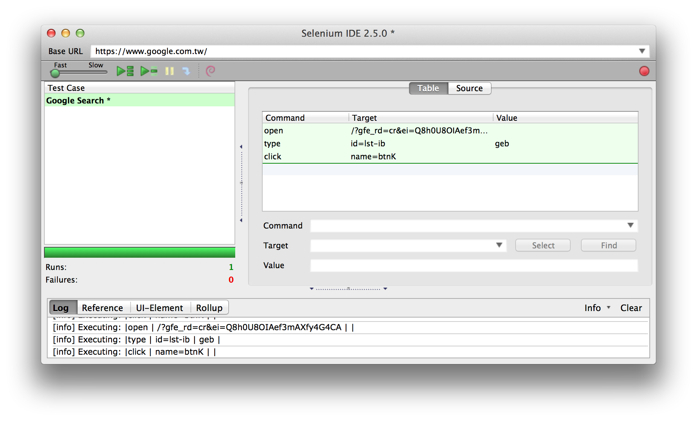

# 認識 Selenium

[Sellenium](http://www.seleniumhq.org/) 是為瀏覽器自動化（Browser Automation）需求所設計的一套工具集合，讓程式可以直接驅動瀏覽器進行各種網站操作。

2004 年在芝加哥 ThoughtWorks 公司工作的 Jason Huggins 建立一個名為「JavaScriptTestRunner」的測試工具（testing tool），ThoughWorks 的風格就是讓各類型的應用程式都能自動化測試，這個最早的測試工具原型，就是 Selenium 開放源碼專案的前身。

Selenium 執行「真實的瀏覽器」來進行網站操作的自動化，它能夠直接獲取即時的內容，包括被 JavaScript 修改過的 DOM 內容，讓程式可以直接與網頁元素即時互動、執行 JavaScript 程式，因此也適用於前端採用 AJAX 技術的網站。

Selenium 是許多 Web Testing 工具的核心，利用 Selenium 操作網頁表單資料、點選按鈕或連結、取得網頁內容並進行檢驗，可以滿足相當多測試的需求。

Selenium 發展迄今，已有四個主要的專案發行。

* Selenium IDE
* Selenium Remote Control
* Selenium WebDriver
* Selenium Grid

第一次學習 Selenium 工具時，建議可以從 Selenium IDE 開始接觸，它有圖形化介面，能用滑鼠簡單地完成一些測試案例。

# Selenium IDE

Selenium IDE 是 Firefox 附加元件（extension），需要搭配 Firefox 瀏覽器才能使用。

> 使用 Firefox 安裝 [Sellenium IDE Plugins](http://docs.seleniumhq.org/projects/ide/) 

在 Firefox 瀏覽器的「工具」選單，打開「Selenium IDE」，會出現下面這個視窗畫面。



操作 Selenium IDE 就像錄影機，在開始「錄製」後，在瀏覽器操作網站的動作就會被捕捉，產生測試案例（Test Case）的內容。錄製完成後，可以用「播放」重新把網站操作過程重播一次。

這是使用 Selenium 進行網站自動化的基礎，以 Google 搜尋為例，建立一組測試案例包含：

1. 打開網址 URL：「http://google.com」
2. 找到填寫關鍵字的表單文字欄位 `<input />`，填入字串（Type）
3. 找到「搜尋」按鈕，按下（Click）
4. 取得搜尋結果，檢查結果是否包含預期的內容

## Selenium WebDriver

許多 Web Test Framework，都是以 Sellenium API 作為基礎，功能強大且穩固已經讓 Sellenium 成為瀏覽器自動化的基石。Sellenium 2.0 帶來 WebDriver 的實作，跨越不同瀏覽器的自動化操作，有更清楚定義的標準可循，目前 [WebDriver API](http://www.w3.org/TR/webdriver/) 規範已提交 W3C，若能夠被標準化且在各大瀏覽器實作，執行跨瀏覽器的自動化測試工作將會被簡化許多。

在 Sellenium 及開放源碼社群的努力下，已有許多 WebDriver 可供使用，包含目前佔有率最高的 Google Chrome、Firefox 與 InternetExplorer，已能滿足大多數網站自動化測試的需求。

Sellenium WebDriver API 支援 Java、C#、Ruby、Python 及 Perl 等多種語言，以下是 Java 語言的範例程式碼，示範以 Firefox 瀏覽器打開 Google 網站、搜尋「selenium」關鍵字的自動化操作。

```java
WebDriver driver = new FirefoxDriver();
driver.get("http://www.google.com");
WebElement element = driver.findElement(By.name("q"));
element.sendKeys("selenium");
element.submit();
System.out.println("Title: " + driver.getTitle());
driver.quit();
```
